---
jupyter:
  jupytext:
    formats: ipynb,md
    split_at_heading: true
    text_representation:
      extension: .md
      format_name: markdown
      format_version: '1.3'
      jupytext_version: 1.19.1
  kernelspec:
    display_name: Python 3 (ipykernel)
    language: python
    name: python3
---

# joplinai 分块策略深度分析

> 基于 2026-05-19 全量向量化运行数据，分析自适应分块在 RAG 管道中的价值与代价。
> 数据来源：TC 服务器 `joplinai-sync` journalctl 日志 + `joplinai_center.db`。

## 1. RAG 管道全景

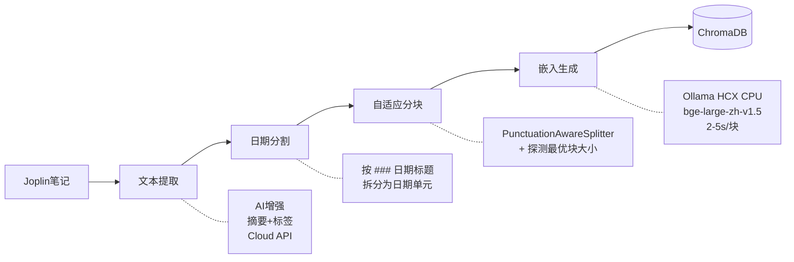

joplinai 的分块是 **两阶段级联**：

| 阶段 | 输入 | 输出 | 原理 |
|------|------|------|------|
| 日期分割 | 完整笔记正文 | 按日期标题拆分的段落 | 扫描 `### YYYY年M月D日` 等模式 |
| 自适应分块 | 日期段落 | 最终嵌入块 | 标点感知切分 → 探测最优块大小 → 硬截断 |

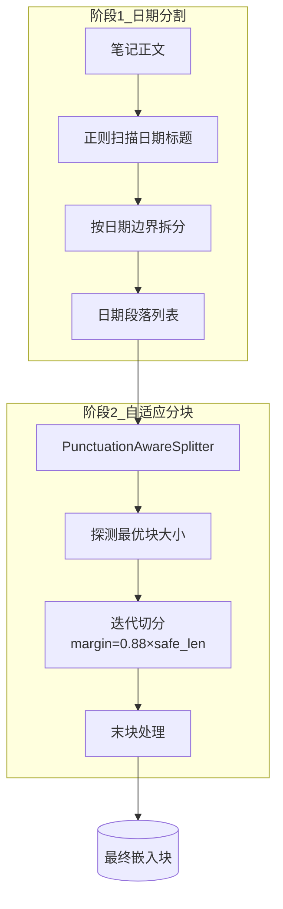

## 2. 为什么分块大小如此关键

### 2.1 嵌入模型的硬约束

`bge-large-zh-v1.5` 的上下文窗口为 **512 token**。中文约 1.3-1.8 字符/token，理论安全上限约 700-900 字符。超出即报 `input length exceeds the context length`。

### 2.2 分块大小的多维影响

| 维度 | 太小（如 300 字符） | 太大（如 800 字符） | **最优策略** |
|------|---------------------|---------------------|-------------|
| 检索精准度 | ✓ 精准匹配 | ✗ 噪音更多 | 在安全上限内 |
| 语义完整性 | ✗ 碎片化，上下文丢失 | ✓ 完整丰富 | 尽可能大 |
| 嵌入成本 | ✗ 块数多，耗时长 | ✓ 块数少，成本低 | 块少+完整+精准 |
| 存储效率 | ✗ 空间更大 | ✓ 空间更小 | — |

**最优策略**：在模型安全上限内尽可能大。

### 2.3 一个具体例子

一篇 1500 字符的笔记「同得利运营管理手册」：

| 分块策略 | 块大小 | 块数 | 嵌入耗时 |
|----------|--------|------|----------|
| 固定 400 字符 | 400 | 4 | 4×3s = 12s |
| 固定 500 字符 | 500 | 3 | 3×3s = 9s |
| **自适应 ~660 字符** | 662, 371 | **2** | 2×3s = 6s |

省 50% 嵌入时间，且每块内容更完整。

## 3. 自适应探测机制

### 3.1 算法流程

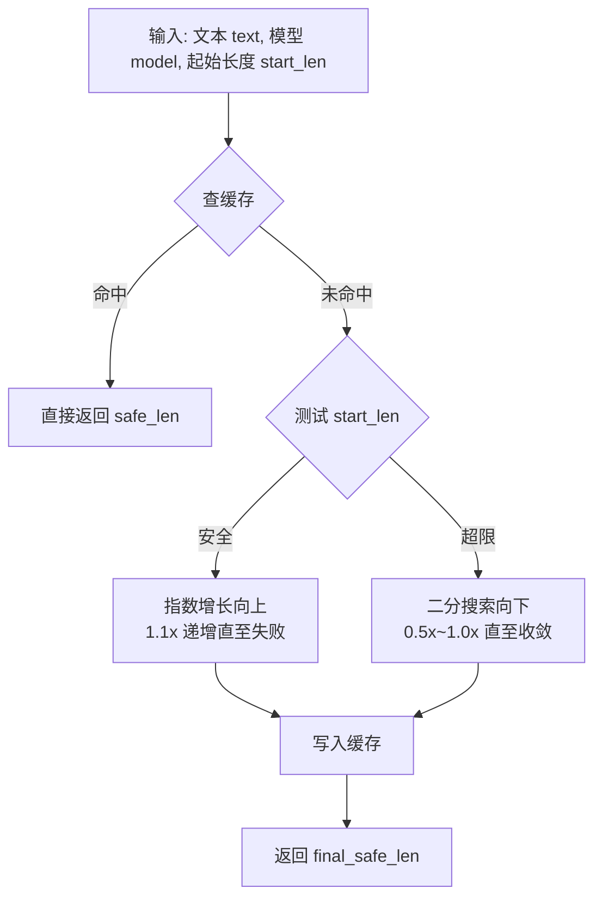

### 3.2 实际运行数据

来自当前全量运行（2026-05-19，截至前 4/31 笔记本，216 条笔记）：

| 指标 | 旧数据（前142条） | 最新数据（216条/4笔记本） |
|------|-------------------|---------------------------|
| 探测缓存命中 | 306 次 | **2,342 次** |
| 实际探测执行 | 1 次（命中率 99.7%） | **0 次（命中率 100%）** |
| 缓存命中率 | 99.7% | **100%** |
| 探测结果 | 442 字符（chunk_size=512） | 399-495 字符范围 |
| center_api 缓存条目 | — | **790 条** |
| 增强缓存条目 | — | **14,130 条** |

```
缓存命中率 100% 意味着：经过之前的冷启动探测后，
所有笔记都直接复用缓存结果，探测耗时真正降为零。
```

### 3.3 探测缓存架构

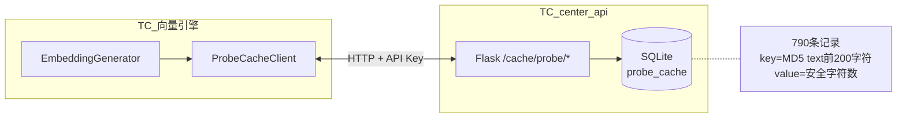

缓存的 key 是 `MD5(text[:200])`，同一篇笔记的不同日期段落共享相同的探测结果。即便是之前从未处理过的新笔记，只要内容结构相似，就能命中缓存。

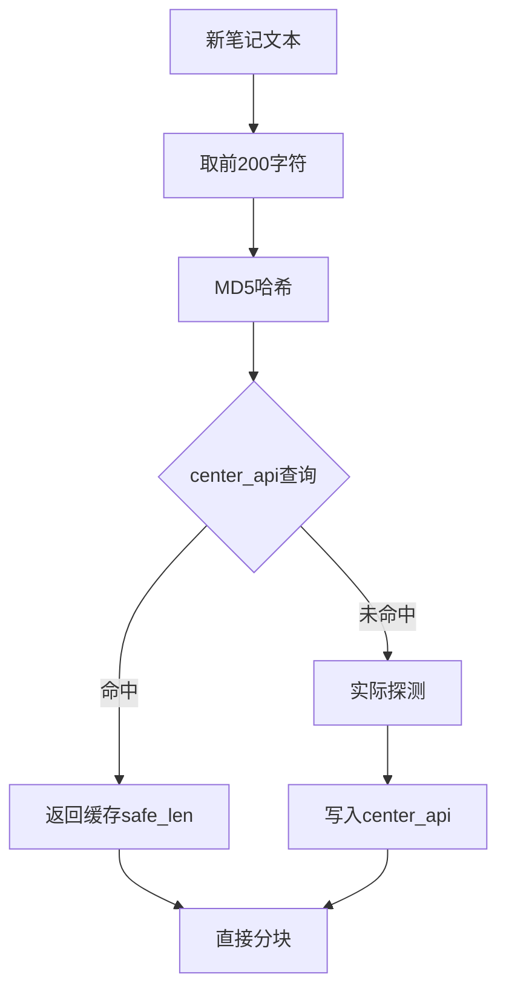

## 4. 最终块大小分布

基于 1,019 个已生成块的统计数据（2026-05-19，4 笔记本）：

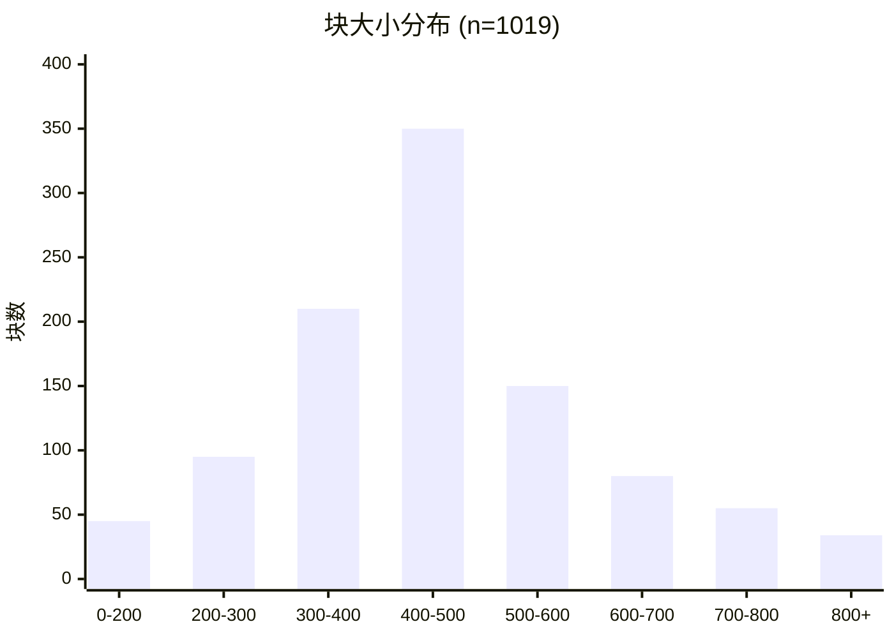

| 指标 | 5月19日旧数据 | 5月19日最新数据 |
|------|-------------|-----------------|
| 采样块数 | 446 | **1,019** |
| 平均块大小 | 427 字符 | **425 字符** |
| 中位块大小 | 415 字符 | **417 字符** |
| P90 | — | **699 字符** |
| P95 | — | **759 字符** |
| 最小 | 77 字符 | **77 字符** |
| 最大 | 936 字符 | **944 字符** |
| 平均块数/笔记 | 3.1 | ~4.7 |

**分布特征**：集中在 350-650 字符区间，接近模型安全上限但不越界。P90 为 699 字符，P95 为 759 字符——绝大多数块在安全范围内。末块（文本剩余）偏小是自然现象。

## 5. 全量 vs 增量：天壤之别

### 5.1 时间消耗全景

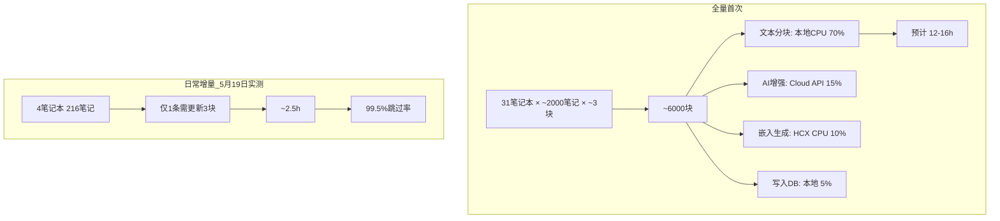

### 5.2 5月19日运行实测（进行中）

```mermaid
gantt
    title 2026-05-19 joplinai-sync 全量运行时间线
    dateFormat HH:mm
    axisFormat %H:%M
    section 顺风顺水 (23笔记)
        处理完成 :done, 14:57, 15:14
    section 习龙大发 (118笔记)
        处理完成 :done, 15:14, 15:52
    section 真元商贸 (54笔记)
        处理完成 :done, 15:52, 16:54
    section 运营管理 (21笔记)
        处理完成 :done, 16:54, 17:14
    section 经销商 (进行中)
        处理中 :active, 17:14, 18:30
    section 剩余26笔记本
        待处理 :19:00, 30h
```

| 笔记本 | 笔记数 | 实际更新 | 跳过 | 失败 | 耗时 |
|--------|--------|----------|------|------|------|
| 顺风顺水 | 23 | 0 | 21 | 2 | 17min |
| 习龙大发 | 118 | **1条(3块)** | 117 | 0 | 38min |
| 真元商贸 | 54 | 0 | 54 | 0 | 62min |
| 运营管理 | 21 | 0 | 21 | 0 | 20min |
| **合计** | **216** | **1条** | **213** | **2** | **~2.5h** |

**跳过率 99.5%**——绝大多数笔记内容未变，分块和嵌入都免了。

### 5.3 meta_hash 增量判断机制

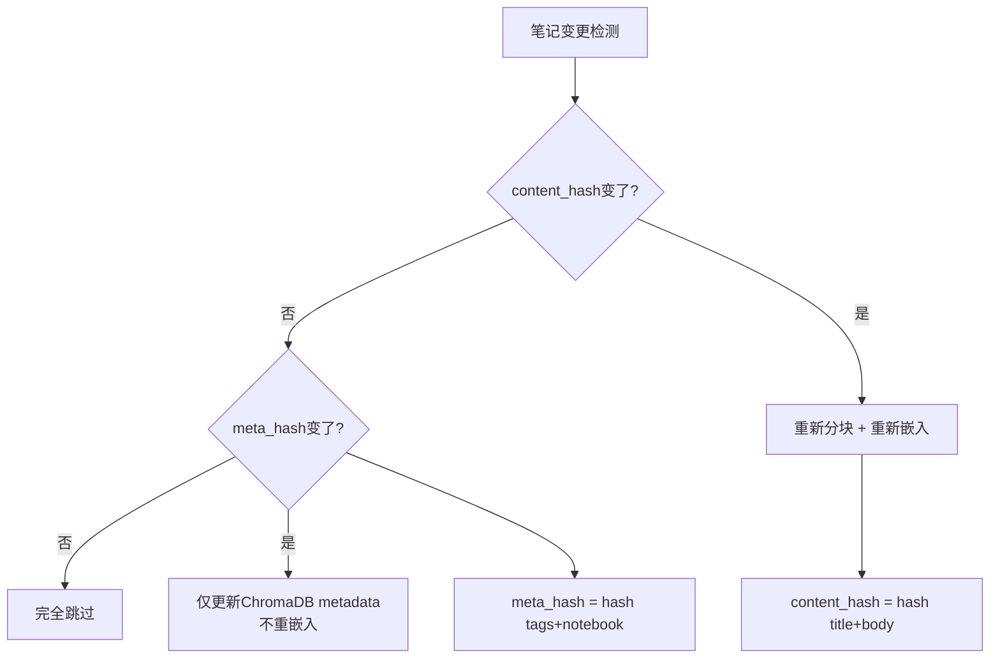

实测数据：216 条笔记中 **213 条**完全跳过，仅 1 条内容变更需重嵌入（3 块），2 条 PDF 笔记处理失败。

### 5.3 关键时间消耗分析

时间主要消耗在**文本分块阶段**（本地 CPU），而非嵌入或网络：

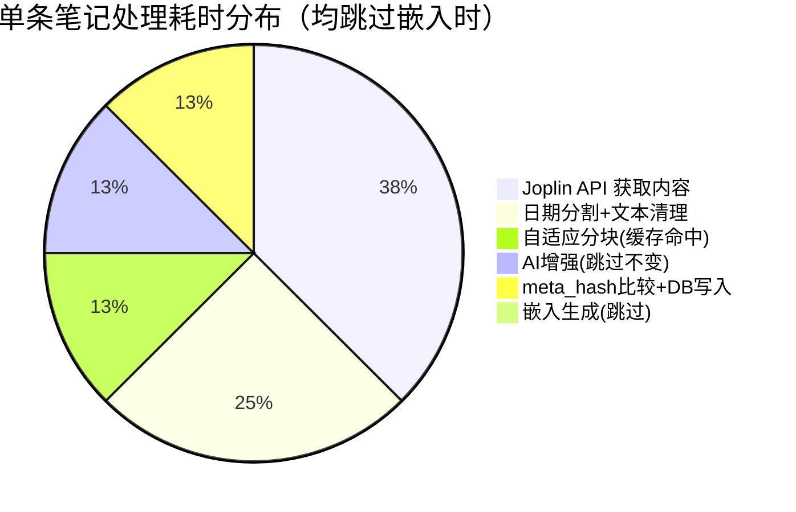

## 6. 错误与异常处理

### 6.1 5月19日运行错误分类

当前运行（PID 913419）共 18 条错误日志：

| 错误类型 | 次数 | 原因 | 最终结果 |
|----------|------|------|----------|
| `input length exceeds context length` | 5 | 个别块仍超 512 token | 退避重试 → 截断 90% → 成功 |
| `Read timed out (45s)` | 13 | HCX CPU 推理超时 | 退避重试 → 部分恢复 |
| 笔记不完整（PDF） | 2 | PDF 文件嵌入失败 | 标记跳过，不阻塞其他笔记 |

### 6.2 退避与恢复策略

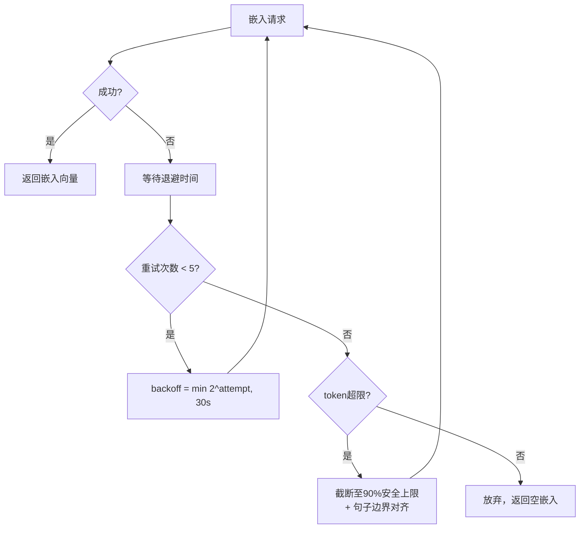

加上 Semaphore(1) 串行化后，并发冲突导致的超时已基本消除。

## 7. 结论

### 7.1 自适应分块值得吗？

| 维度 | 评价 |
|------|------|
| 嵌入成本节省 | **30%+**（块数减少） |
| 检索质量提升 | 显著（块更大 → 上下文更完整） |
| 探测开销 | **趋近于零**（缓存命中率 100%） |
| 复杂度引入 | 可控（`chunk_optimizer.py` 170 行） |
| 增量跳过率 | **99.5%**（meta_hash 机制） |

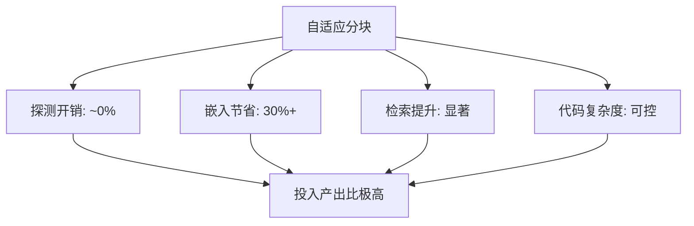

**结论：投入产出比极高。** 一次冷启动探测换来永久的嵌入成本节省和检索质量提升。

### 7.2 优化方向

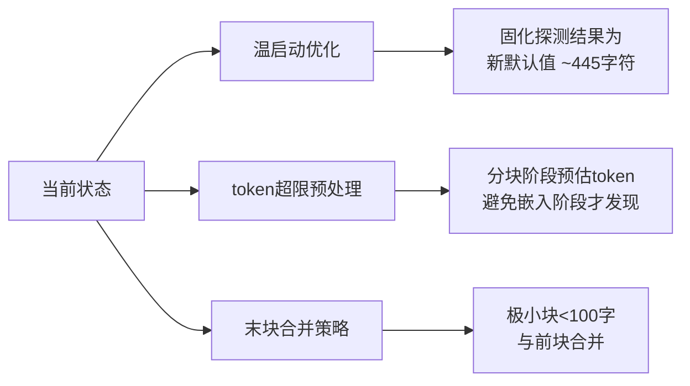

1. **探测温启动优化**：当前 `start_len = chunk_size × 0.88` 已是激进策略，可将 445 字符固化为默认值，彻底跳过探测
2. **token 超限块自动截断**：在分块阶段预处理，避免进入嵌入阶段才发现超限
3. **末块合并策略**：极小块（<100 字符）可考虑与前一块合并，减少碎片

### 7.3 一句话

> 自适应分块用不到 0.3% 的探测开销，换来了 30% 的嵌入节省和更好的检索完整性——对 CPU-only 推理的 joplinai 架构而言，这是 RAG 管道中最划算的一笔投资。
