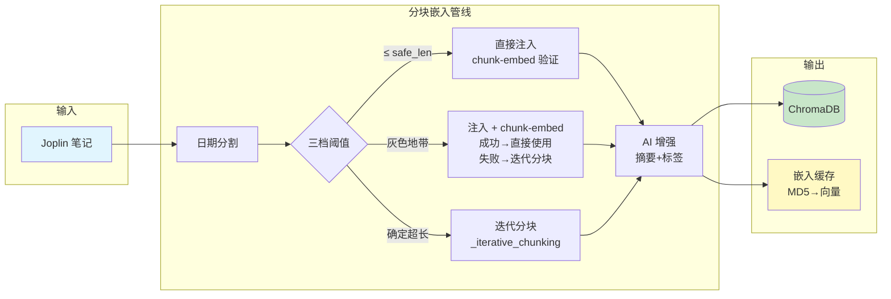
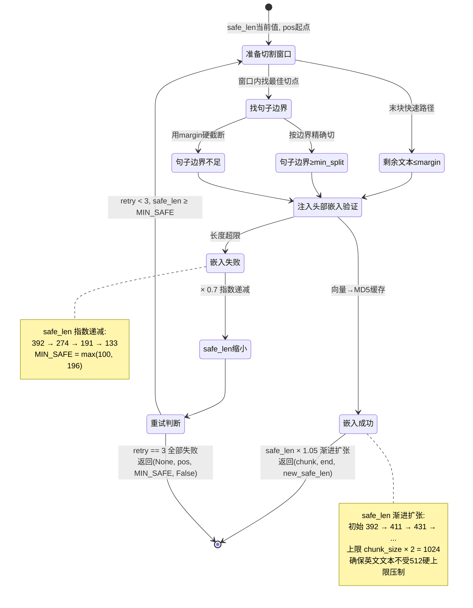
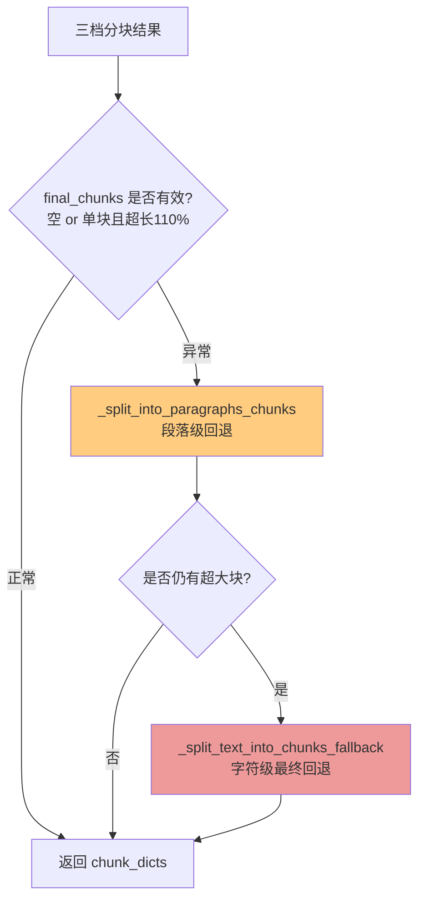
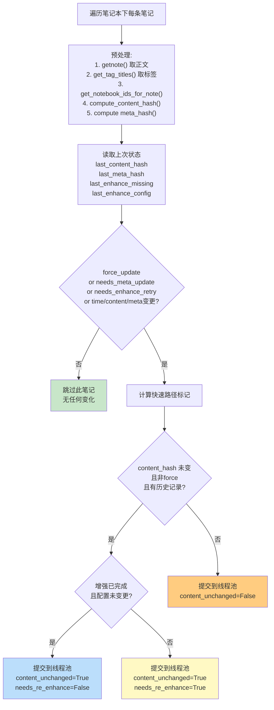
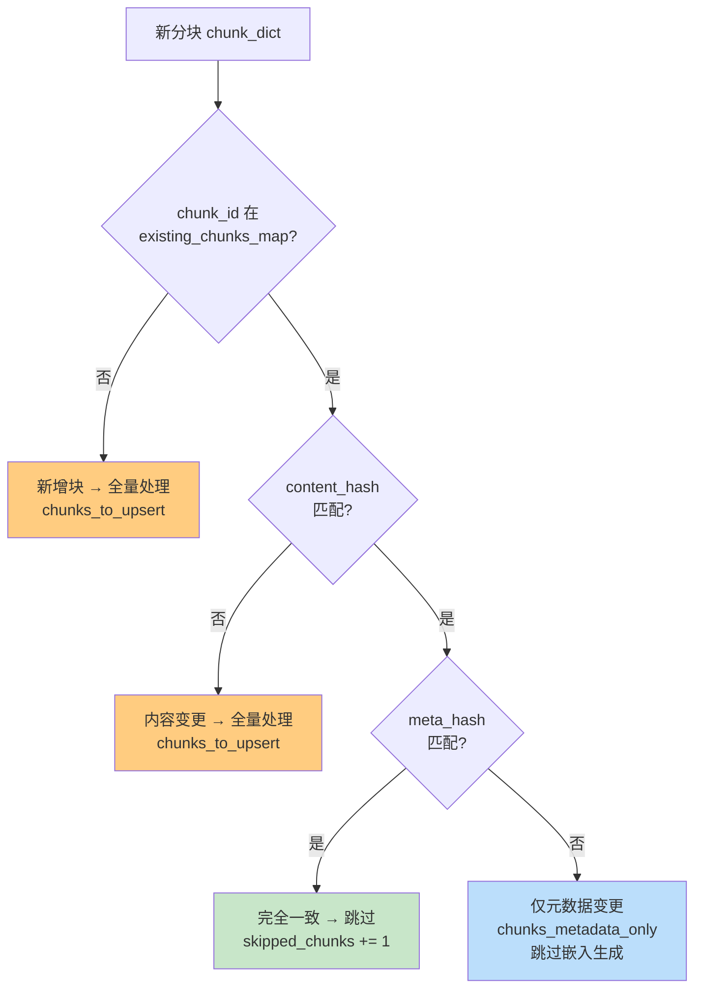
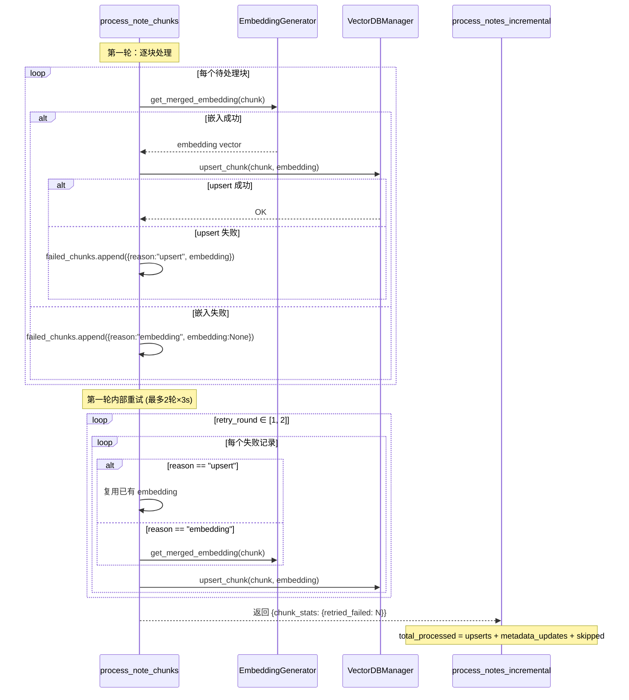
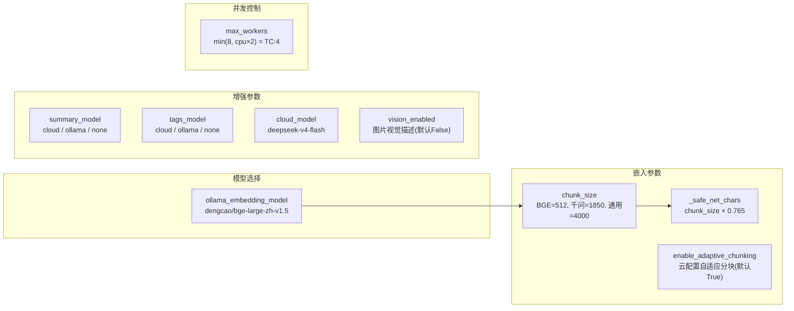

---
jupyter:
  jupytext:
    formats: ipynb,md
    split_at_heading: true
    text_representation:
      extension: .md
      format_name: markdown
      format_version: '1.3'
      jupytext_version: 1.19.1
  kernelspec:
    display_name: Python 3 (ipykernel)
    language: python
    name: python3
---

# joplinai 分块嵌入系统技术参考

> 分块嵌入（Chunk & Embed）是向量化管线的核心模块，负责将 Joplin 笔记文本切分为语义块、生成嵌入向量、AI 增强元数据，并支持增量更新。本文档为开发者技术参考，描述当前生产系统实际运行的行为。

## 1. 系统全景



| 阶段 | 方法 | 输入 | 输出 |
|------|------|------|------|
| 1. 日期分割 | `UNIFIED_DATE_PATTERN` 正则 | 笔记全文 | 按日期标题拆分的段落列表 |
| 2. 自适应分块嵌入 | `_chunk_and_embed` / `_iterative_chunking` | 日期段落 | 已注入上下文的文本块 + 嵌入向量(MD5缓存) |
| 3. AI 增强 | `enhance_chunk_metadata` | 文本块内容 | 摘要 + 标签 + 作者信息 |
| 4. 哈希构建 | `compute_content_hash` / meta_hash | 内容 + 元数据 | chunk_dict |

## 2. 分块嵌入核心机制

### 2a. 三档阈值决策

```mermaid
flowchart TD
    RAW["日期段落 raw_chunk"] --> LEN{len(raw_chunk) ≤<br/>safe_net_chars?<br/><i>chunk_size × 0.765</i>}

    LEN -->|是 第1档| FAST["直接注入上下文<br/>_try_embed_or_fail"]
    FAST --> APPEND1[追加到 final_chunks]

    LEN -->|否| GREY{len(raw_chunk) ≤<br/>chunk_size × 0.9?<br/><i>且 enable_adaptive</i>}

    GREY -->|是 第2档| PROBE["注入上下文<br/>_try_embed_or_fail"]
    PROBE --> PROBE_OK{嵌入成功?}
    PROBE_OK -->|是| APPEND2[追加到 final_chunks]
    PROBE_OK -->|否| ITER1["_iterative_chunking<br/>自适应分块"]

    GREY -->|否 第3档| ITER2["_iterative_chunking<br/>统一迭代分块"]
    ITER1 --> APPEND3[追加子块到 final_chunks]
    ITER2 --> APPEND3

    style FAST fill:#c8e6c9
    style PROBE fill:#fff9c4
    style ITER1 fill:#ffcc80
    style ITER2 fill:#ffcc80
```

**阈值说明**（以 bge-large-zh-v1.5、chunk_size=512 为例）：

| 档位 | 条件 | 策略 | 嵌入调用次数 |
|------|------|------|:----------:|
| 第1档 | ≤392 字符 (512×0.765) | 直接注入，必须嵌入成功 | 1 |
| 第2档 | 393~461 字符 | 尝试直接嵌入，成功则用，失败则迭代分块 | 1（成功）/ N（失败） |
| 第3档 | >461 字符 | 统一迭代分块 | N |

> `safe_net_chars = chunk_size × 0.765 = 392`。0.765 源自 0.9（安全系数）× 0.85（中文 token 密度），为上下文头部预留净空。

### 2b. Chunk-Embed 状态机



**核心算法 `_chunk_and_embed`**：

1. 计算 `header_body_equiv`（头部按 token 密度折算正文等价长度）
2. `margin = max(MIN_SAFE, (safe_len - header_body_equiv) × 0.95)`
3. 在 margin 窗口内找句子边界（`_find_best_split_position`）
4. 注入上下文头部后调 `_try_embed_or_fail`
5. 成功 → `safe_len × 1.05` 扩张；失败 → `safe_len × 0.7` 缩小；最多 3 次重试

### 2c. 回退路径



### 2d. 无日期笔记处理

当笔记不含任何日期标题行时，跳过日期分割，改用 `GENERAL_SECTION_PATTERN` 按章节/标题分割：

```
GENERAL_SECTION_PATTERN = r'(?=\n(?:#[^#]|第[一二三四五六七八九十]))'
```

匹配一级标题（`#`）或中文序数章节（`第一章`），无标题笔记则整篇作为一个块。

## 3. 增量处理决策系统

### 3a. 笔记级决策（是否提交处理）



### 3b. 块级决策（块哈希比较）



**哈希计算公式**：

| 哈希 | 输入 | 用途 |
|------|------|------|
| `content_hash` | `note.title + note.body` (笔记级) / `chunk_content` (块级) | 检测内容变更 |
| `meta_hash` | `tags_str + notebook_title + chunk_summary` | 检测元数据变更 |
| `enhance_config` | `summary={model}\|tags={model}` | 检测增强模型切换 |

### 3c. 处理路径对比

```
内容变更 → 完整路径:
  分块(嵌入生成) → AI增强(摘要+标签) → 比较哈希 → ChromaDB upsert
  耗时: ~40-100s (取决于块数)

内容未变 + 增强完成 → 快速路径 (_process_metadata_only_fast_path):
  获取既有块元数据 → 重算meta_hash → batch_update_chunks_metadata
  耗时: ~0.5s (一次HTTP)

内容未变 + 增强缺失 → 正常重增强路径:
  分块(嵌入生成) → AI增强 → 比较哈希 → 全部归为metadata_only → batch_update
  耗时: ~40-100s (嵌入部分可优化，TODO)
```

## 4. 失败块重试机制（P0-1）



**重试参数**：

| 参数 | 值 | 说明 |
|------|-----|------|
| 重试轮数 | 2 | 在 `process_note_chunks` 内独立重试 |
| 轮间间隔 | 3s | `time.sleep(3)` |
| 失败区分 | `"embedding"` vs `"upsert"` | embedding 失败重新生成；upsert 失败复用已有嵌入 |
| 元数据保留 | `enhanced_metadata` 全程携带 | `potential_long_chunk` 等标记不丢失 |

## 5. 数据模型

### 5a. Chunk Dict 结构

```python
chunk_dict = {
    "content": "已注入上下文的文本块内容",
    "metadata": {
        # 基础字段
        "chunk_index": 1,              # 块序号（从1开始，有效块连续）
        "source_note_title": "笔记标题",
        "source_note_tags": "标签1,标签2",
        "source_notebook_title": "笔记本标题",
        "estimated_date": "2026-05-21",
        "word_count": 512,
        "content_hash": "md5...",
        "note_author": "白晔峰",
        "note_type": "个人笔记",
        # AI 增强字段
        "chunk_summary": "AI生成的块摘要",
        "tags": "增强后的标签",
        "enhanced": True,
        # 完整性字段
        "meta_hash": "md5(tags+notebook+summary)",
    },
    "embedding": [0.1, 0.2, ...]       # 1024维向量（bge-large-zh-v1.5）
}
```

### 5b. ChromaDB 存储字段

ChromaDB 中每个块的 metadata（`batch_update_chunks_metadata` 写入）：

| 字段 | 类型 | 来源 | 变更时重写 |
|------|------|------|:--------:|
| `chunk_id` | str | `{note_id}_chunk_{index}` | - |
| `tags` | str | AI增强 + 笔记标签 | meta_hash 变 |
| `summary` | str | AI增强 chunk_summary | meta_hash 变 |
| `source_note_title` | str | 笔记标题 | content_hash 变 |
| `source_note_id` | str | 笔记 ID | content_hash 变 |
| `chunk_index` | int | 分块序号 | content_hash 变 |
| `content_hash` | str | MD5(块内容) | content_hash 变 |
| `meta_hash` | str | MD5(tags+notebook+summary) | meta_hash 变 |
| `source_notebook_title` | str | 笔记本标题 | 任一变更 |
| `source_notebook_id` | str | 笔记本 ID | 任一变更 |
| `note_author` | str | `_extract_author_from_note()` | content_hash 变 |
| `note_type` | str | 个人笔记/共享笔记 | content_hash 变 |

### 5c. 嵌入缓存

```python
# embedding_generator.py
_chunk_embedding_cache: Dict[str, List[float]] = {}
# key = MD5(已注入上下文的完整文本)
# value = [float, ...]  # 1024维向量
```

- 同一进程生命周期内有效
- 分块阶段预生成的嵌入，upsert 阶段通过 `get_merged_embedding(chunk)` 零开销复用
- 旧版问题：探测前缀与最终块文本不同→MD5 永远不命中→100% 浪费（chunk-and-embed 重构已修复）

## 6. 配置参数



| 配置键 | 默认值 | 说明 |
|--------|--------|------|
| `ollama_embedding_model` | `dengcao/bge-large-zh-v1.5` | 嵌入模型，TC 远程调 HCX Ollama |
| `chunk_size` | 512 (BGE) | 模型上下文窗口对应的字符上限 |
| `enable_adaptive_chunking` | True | 是否启用自适应分块 |
| `summary_model` | `cloud` | 摘要模型: cloud/ollama/none |
| `tags_model` | `cloud` | 标签模型: cloud/ollama/none |
| `cloud_model` | `deepseek-v4-flash` | 云端大模型 |
| `vision_enabled` | `false` | 图片视觉描述（CPU太慢） |
| `max_workers` | `min(8, cpu×2)` | ThreadPoolExecutor 并发数 |

## 7. 代码位置索引

| 模块 | 文件 | 关键函数/方法 |
|------|------|-------------|
| 分块嵌入 | `aimod/embedding_generator.py` | `split_into_semantic_chunks()`, `_chunk_and_embed()`, `_try_embed_or_fail()`, `_iterative_chunking()`, `enhance_chunk_metadata()` |
| 文本预处理器 | `aimod/text_preprocessor.py` | `TextPreprocessor.normalize_single_date_unit()`, `remove_image_syntax()`, `clean_text()` |
| 上下文分割器 | `aimod/text_splitter.py` | `ContextAwareSplitter._inject_context()`, `_find_best_split_position()` |
| 向量库管理 | `aimod/vector_db_manager.py` | `VectorDBManager.get_existing_chunk_hashes_for_note()`, `batch_update_chunks_metadata()`, `get_chunks_full_metadata()` |
| 笔记增强 | `aimod/note_enhancer.py` | `enhance_chunk_metadata_cloud()`, `enhance_chunk_metadata_ollama()`, `ollama_vision_describe()` |
| 主控流程 | `joplinai.py` | `process_note_chunks()`, `_process_metadata_only_fast_path()`, `process_notes_incremental()` |
| 哈希工具 | `func/datatools.py` | `compute_content_hash()` |

---

## 维护记录

| 日期 | 变更 | 作者 |
|------|------|------|
| 2026-05-21 | 创建文档：chunk-and-embed 重构后首次系统化记录 | Claude Code |
| 2026-05-21 | 新增 P0-1 失败块重试机制、快速路径（content_unchanged） | Claude Code |
| 2026-05-20 | chunk-and-embed 三合一重构（消除探测嵌入浪费） | Claude Code |
