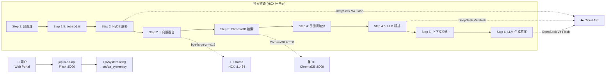
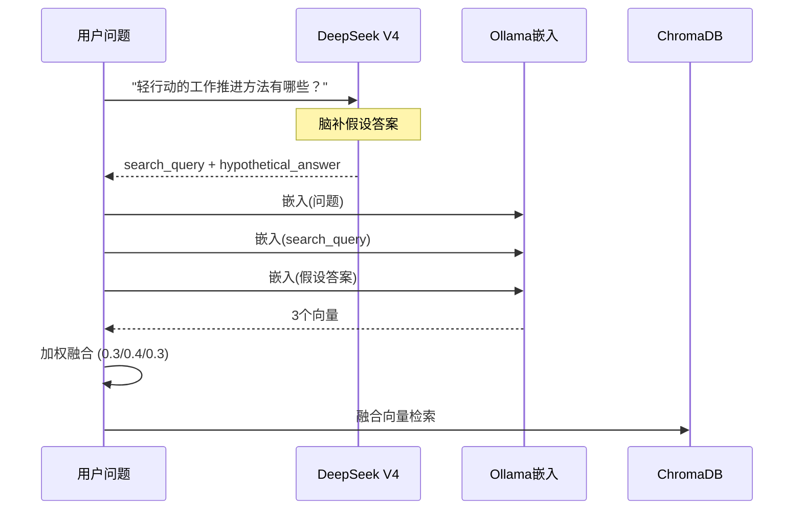

---
jupyter:
  jupytext:
    formats: ipynb,md
    split_at_heading: true
    text_representation:
      extension: .md
      format_name: markdown
      format_version: '1.3'
      jupytext_version: 1.19.1
  kernelspec:
    display_name: Python 3 (ipykernel)
    language: python
    name: python3
---

# joplinai 智能问答检索链路技术手册

从用户提问到 LLM 生成答案的完整技术链路，含示例、流程图和性能剖析。

---

## 1. 架构总览



**服务分布**：

| 组件 | 位置 | 角色 |
|------|------|------|
| joplin-qa-api | HCX (恒创云) | Flask 服务，接收 HTTP 请求 |
| QASystem | HCX | 检索+回答核心逻辑 |
| Ollama | HCX `:11434` | 嵌入向量生成 (CPU) |
| ChromaDB | TC (腾讯云) `:8009` | 向量数据库 |
| DeepSeek V4 Flash | 云端 API | HyDE/精排/答案生成 |

---

## 2. 完整链路逐步解析

以真实提问为例：

> **用户问题**：`轻行动的工作推进方法有哪些？`

### Step 0: 请求入口

```
HTTP POST /qa/ask
Header: X-API-Key: <internal-key>
Body: {"question": "轻行动的工作推进方法有哪些？", "session_id": "abc123"}
```

`joplin_qa_api.py` 解析请求 → 调用 `QASystem.ask(question, user_identity=...)`。

---

### Step 1: 预处理 `_preprocess_question()`

**代码位置**：`src/qa_system.py:179`

```
输入: "轻行动的工作推进方法有哪些？"
  ├─ 去停用词: "有哪些？" → ""
  └─ 检测第一人称: 无 "我"/"我的"

输出: "轻行动的工作推进方法"
```

预处理规则：
- **去口语前缀**：`请问`、`请`、`帮我`、`我想知道`、`什么是`、`怎么`、`如何`
- **第一人称补充**：问题含 `我`/`我的` 时，自动加前缀 `个人笔记`，引导向量偏向个人笔记

---

### Step 1.5: jieba 中文分词 `_extract_keywords()`

**代码位置**：`src/qa_system.py:194`

```python
import jieba
words = jieba.lcut("轻行动的工作推进方法")
# → ['轻', '行动', '的', '工作', '推进', '方法']
```

```
统计词频，过滤停用词 (的/了/在/是/我/你/他/她/它/这/那)，
取 top-5 高频词。

输出关键词: ["行动", "工作", "推进", "方法", "哪些"]
```

**为什么用 jieba**：中文词间无空格，`text.split()` 会把整句当做一个"词"，无法提取有效关键词。jieba 基于前缀词典完成中文分词。

**回退机制**：jieba 不可用时自动降级为 `text.split()`（英文环境兼容）。

---

### Step 2: HyDE 查询增强 `_generate_hyde()`

**代码位置**：`src/qa_system.py:221`

> **HyDE** = Hypothetical Document Embedding（假设文档嵌入）
>
> 核心直觉：用户口语提问和笔记书面语之间存在语义差距。与其拿问题直接搜，不如让 LLM 先"脑补"一个假设答案，用假设答案的嵌入去搜。



**DeepSeek 输入/输出示例**：

```
输入 Prompt:
  你是个人笔记助手。用户提问后，请帮助优化向量检索。
  用户问题：轻行动的工作推进方法有哪些？

  请生成两个字段：
  1. search_query：3-8个关键词，用于向量检索
  2. hypothetical_answer：假设用户笔记中可能如何记录这个主题，
     生成一段100-200字的假设笔记

  严格返回JSON：{"search_query": "...", "hypothetical_answer": "..."}

输出:
  {
    "search_query": "轻行动 工作推进 方法 效率 低阻力 行动策略 小步快跑",
    "hypothetical_answer": "轻行动的工作推进方法核心是降低启动阻力，
      用最小的行动打破拖延。常用策略包括：两分钟法则（任何两分钟内
      能完成的事立刻做）、微习惯（每天做一个极小的动作）、番茄工作法。
      关键在于不要追求完美，先完成再完美…"
  }
```

**为什么有效**：假设答案的文本风格（书面语、结构化表述）更接近笔记原文，其嵌入向量比口语问题的嵌入更贴近 ChromaDB 中的实际笔记。

**失败降级**：DeepSeek 调用超时/失败 → 返回 `None` → 后续步骤使用原始问题嵌入（零影响）。

---

### Step 2.5: 三向量加权融合 `_fuse_hyde_embedding()`

**代码位置**：`src/qa_system.py:268`

```
┌─────────────────────────────────────────────────┐
│              三向量加权融合                       │
├─────────────────┬───────┬───────────────────────┤
│ 文本来源         │ 权重  │ 示例 (前20字)          │
├─────────────────┼───────┼───────────────────────┤
│ 原始问题         │ 0.30  │ "轻行动的工作推进方法"  │
│ HyDE search_query│ 0.40  │ "轻行动 工作推进 方法…" │
│ HyDE 假设答案    │ 0.30  │ "轻行动的工作推进方法核…"│
└─────────────────┴───────┴───────────────────────┘

算法:
  for i in range(1024):
      fused[i] = orig[i]×0.30 + search[i]×0.40 + hypo[i]×0.30

返回: 1024维浮点向量
```

**嵌入缓存**：`get_merged_embedding()` 内部以内容哈希为键缓存嵌入结果。原始问题嵌入在 Step 0 已算过一次，这里命中缓存，**实际只调 Ollama 2 次**（search_query + 假设答案），不是 3 次。

**权重设计原理**：
- `search_query` 权重最高 (0.4)：LLM 提取的精炼关键词，噪声最少
- `假设答案` (0.3) 和 `原始问题` (0.3) 各占三分之一，平衡覆盖面和精确度

---

### Step 3: ChromaDB 向量检索

**代码位置**：`src/qa_system.py:133`

```
QASystem.vector_db.search_similar_chunks(
    query_embedding=fused_vector,   # 1024维融合向量
    limit=50,                        # 返回 top-50
    user_identity={...}              # 权限过滤
)

↓ HTTP → TC ChromaDB (cosine similarity)

返回: 50个候选块，含 metadata/similarity/content
相似度样例: [0.7442, 0.7058, 0.7003, 0.6934, 0.6809, …]
```

**ChromaDB 配置**：

| 参数 | 值 |
|------|------|
| 集合名 | `joplin_dengcao_bge_large_zh_v1.5` |
| 嵌入维度 | 1024 |
| 相似度算法 | cosine |
| 当前块数 | ~8233 |
| 连接方式 | HTTP → TC `122.51.102.233:8009` |

---

### Step 4: 关键词加分 `_filter_and_rank_chunks()`

**代码位置**：`src/qa_system.py:308`

```
对 50 个候选块逐一打分：

┌────────────────────────────────────────────────┐
│ 总分 = 向量相似度 + 正文命中×0.10               │
│                   + 标签命中×0.15               │
│                   + 摘要命中×0.15               │
└────────────────────────────────────────────────┘

以 "行动" 关键词为例，对某候选块:
  sim    = 0.7442   ← ChromaDB 向量相似度
  "行动" in content ? 是 → +0.10
  "行动" in tags    ? 是 → +0.15
  "行动" in summary ? 是 → +0.15
  该关键词贡献: +0.40
```

**真实评分表（Step 4 输出）**：

```
排名  sim      +正文  +标签  +摘要  =总分   标题
─────────────────────────────────────────────────────
 1   0.7442   0.20  0.30  0.30  1.544  轻行动工作清单
 2   0.6519   0.20  0.30  0.30  1.452  日记笔记-2026年 ⚠
 3   0.7003   0.20  0.30  0.15  1.350  轻行动会议备忘录
 4   0.6934   0.20  0.30  0.15  1.343  轻行动会议备忘录
 5   0.6809   0.20  0.30  0.15  1.331  轻行动工作清单
 6   0.7058   0.30  0.30  0.00  1.306  轻行动会议备忘录
 7   0.6724   0.20  0.30  0.15  1.322  轻行动会议备忘录
 8   0.6514   0.20  0.30  0.15  1.301  轻行动工作清单
```

**注意第 2 名**：一篇日记因为标签恰好大量命中关键词，被推到了不应有的高位。Step 4.5 的 LLM 精排会纠正这个错误。

**加分权重设计原理**：
- **标签 +0.15**：AI 事先生成的 3-5 个核心关键词，最精确
- **摘要 +0.15**：AI 生成的 1-3 句内容概括，比正文噪声少
- **正文 +0.10**：原文匹配，最直接但噪声最多

---

### Step 4.5: LLM 精排 `_rerank_by_llm()`

**代码位置**：`src/qa_system.py:359`

> RankGPT 风格：将 top-20 候选块交给 LLM，让它按相关性直接排序。

```
┌─────────────────────────────────────────────┐
│          LLM 精排 (DeepSeek V4)              │
├─────────────────────────────────────────────┤
│ 输入: 问题 + 20个候选块 (标题+标签+内容前200字)│
│ 输出: 相关性从高到低的编号序列                 │
│ 耗时: ~14s (含 ~530 推理 tokens)             │
│ 费用: ~$0.0005 / 次                         │
│ 回退: LLM失败时保留原序                       │
└─────────────────────────────────────────────┘
```

**Prompt 示例**：

```
请根据问题对以下笔记片段进行相关性排序:

问题：轻行动的工作推进方法有哪些？

[0] 【轻行动工作清单】
标签：时间节点, 图形化, 热图, 工作清单, 轻行动…
内容：今天按轻行动方法论整理了本周工作清单…

[1] 【日记笔记（白晔峰）-2026年】
标签：轻行动, 工作, 方法, 效率…
内容：上午开了轻行动工作推进方法的讨论会…

[2] 【轻行动会议备忘录（广州元大经贸）】
标签：业务发展, 实战靶, 工作量化, 轻行动…
内容：晚上白总复盘将我们工作的模块化以及标准化…
…

按相关性从高到低列出编号: 2, 0, 5, 3, 1, …
```

**精排效果**：

```
精排前 top-3                    精排后 top-3
──────────────────────         ──────────────────────
1. 轻行动工作清单               1. 轻行动会议备忘录    ↑ (原#3)
2. 日记笔记-2026年 ⚠           2. 轻行动会议备忘录    ↑ (原#4)
3. 轻行动会议备忘录             3. 轻行动会议备忘录    ↑ (原#6)
```

LLM 正确识别出：
- "日记笔记"虽然关键词命中多，但实质内容是流水账，**不应排高位**
- "会议备忘录"里才有真正的**方法论讨论**（模块化、标准化、复盘），是最相关的
- 精排后 top-3 纯度 100%（之前混入一篇无关日记）

**DeepSeek V4 推理模型适配**：V4 是推理模型，排序时会先进行内部思维链推理（约 530 tokens），再输出编号。需 `max_tokens ≥ 4000` 确保推理不截断。

---

### Step 5: 上下文构建 `_build_optimized_context_from_chunks()`

**代码位置**：`src/qa_system.py:442`

将精排后的 chunk 按笔记聚合并构建 LLM 可读的上下文：

```
┌─────────────────────────────────────────────┐
│  按 source_note_id 聚合 chunks               │
│  每个 chunk 前加 [摘要] 预览                  │
│  合并同笔记 tags                            │
│  加入系统提示词 + 对话历史                    │
│  截断至 context_max_length (默认 4000)       │
└─────────────────────────────────────────────┘
```

**构建的上下文格式**：

```
你是Joplin笔记助手…[系统提示词636字]

相关笔记内容：

【笔记：轻行动会议备忘录（广州元大经贸） | 类型：团队协作 | 作者：团队_共同维护】
标签：牛亚飞,铺市,售后,工作量化,轻行动,元大,广州元大经贸,陈列,复盘…
相关内容：
[摘要] 该会议备忘录核心主题是推动工作的模块化与标准化，结论要求团队…
【轻行动会议备忘录（广州元大经贸）】
日期：2026年4月9日

晚上白总复盘将我们工作的模块化以及标准化，今晚我提出大的两大思维模块就是
固定靶和移动靶，固定靶的意思就是我们要有基本面的建设，必须百分百地执行落地；
移动靶的意思就是我们要有超常规，击打能力要强…[完整chunk内容]

---
[摘要] 该笔记记录了轻行动工作清单的具体内容，包括时间节点、热图…
【轻行动工作清单】
…[下一个chunk内容]
```

**上下文长度对比**：

| 版本 | 上下文长度 | 说明 |
|------|:--------:|------|
| 无摘要预览 | ~12,600 字符 | 旧版，LLM 需自行提炼 |
| 含摘要预览 | ~18,300 字符 | 增加 ~45%，但信息密度更高 |

---

### Step 6: LLM 生成答案

**代码位置**：`src/qa_system.py:507`

```
POST https://api.deepseek.com/v1/chat/completions
Model: deepseek-v4-flash
Max tokens: 1800
Temperature: 0.3
```

**完整请求体结构**：

```json
{
  "model": "deepseek-v4-flash",
  "messages": [
    {
      "role": "system",
      "content": "你是我个人的笔记助手，帮助我回忆和整理笔记内容。"
    },
    {
      "role": "user",
      "content": "[系统提示词]\n\n相关笔记内容：\n【笔记：…】\n…\n\n我的问题：轻行动的工作推进方法有哪些？\n\n请基于以上笔记内容回答，如果笔记中没有相关信息，请说明。"
    }
  ],
  "temperature": 0.3,
  "max_tokens": 1800
}
```

---

## 3. 完整示例走查

```
用户输入: "轻行动的工作推进方法有哪些？"
═══════════════════════════════════════════════════════

Step 1  预处理
         "轻行动的工作推进方法有哪些？"
         → "轻行动的工作推进方法"
         耗时: <1ms

Step 1.5 jieba分词
         关键词: [行动, 工作, 推进, 方法, 哪些]
         耗时: <1ms

Step 2  HyDE脑补 (DeepSeek API)
         search_query: "轻行动 工作推进 方法 效率 低阻力 行动策略 小步快跑"
         hypothetical_answer: "轻行动的工作推进方法核心是降低启动阻力…"
         耗时: ~4.4s       费用: ~$0.00004

Step 2.5 向量融合 (Ollama嵌入×2)
         fused[0..1023] = orig×0.30 + search×0.40 + hypo×0.30
         耗时: ~19.6s       (CPU嵌入，2次)

Step 3   ChromaDB 检索 (TC)
         top-50, cosine similarity
         top sim: [0.74, 0.71, 0.70, …]
         耗时: ~0.2s        (网络往返TC)

Step 4   关键词加分
         sort by sim + content×0.10 + tags×0.15 + summary×0.15
         排名修正: #2日记笔记(0.65→1.45)暂时虚高
         耗时: <1ms

Step 4.5 LLM精排 (DeepSeek API)
         重排: [会议备忘录, 会议备忘录, 会议备忘录, 工作清单, …]
         纠正: 日记笔记被挤出top-3
         耗时: ~13.7s      费用: ~$0.00050

Step 5   上下文构建
         3792字符, 含[摘要]预览, 含系统提示词
         耗时: <1ms

Step 6   LLM生成答案 (DeepSeek API)
         返回: Markdown格式的轻行动方法论详解
         耗时: ~10s        费用: ~$0.00134

═══════════════════════════════════════════════════════
总耗时: ~48s (检索) + ~10s (生成) = ~58s
总费用: ~$0.0019 / 次 (约 ¥0.013)
```

---

## 4. 性能剖析

```
各步骤耗时占比 (检索阶段 48s):
────────────────────────────────────────────
  Ollama嵌入 (2次)  ████████████████████  19.6s  41%
  LLM精排           ██████████████        13.7s  29%
  LLM答案生成       ██████████            10.0s  21%
  HyDE脑补          ████                  4.4s    9%
  ChromaDB检索      ░                     0.2s   <1%
  其他(分词/加分等)  ░                    <1ms   <1%
────────────────────────────────────────────
```

**瓶颈分析**：

| 瓶颈 | 原因 | 优化方向 |
|------|------|----------|
| Ollama 嵌入 | HCX 纯 CPU，每次 2-3s，HyDE 需 2 次 | 换 GPU 或启用云端嵌入 API |
| LLM 精排 | DeepSeek V4 推理模型，~530 token 思维链 | 换非推理模型（如 deepseek-chat） |
| 3 步串行 LLM 调用 | HyDE → 精排 → 答案，严格串行 | HyDE+精排可并行？(互斥，不能) |

---

## 5. 配置开关

| 配置键 | 默认值 | 说明 | 代码位置 |
|--------|:------:|------|----------|
| `hyde_enabled` | `true` | HyDE 查询增强开关 | `_fuse_hyde_embedding` |
| `rerank_enabled` | `true` | LLM 精排开关 | `_rerank_by_llm` |
| `similarity_threshold` | `0.5` | 向量相似度最低阈值 | `_filter_and_rank_chunks` |
| `context_max_length` | `4000` | LLM 上下文截断长度 | `_build_optimized_context` |
| `max_retrieved_chunks` | `20` | ChromaDB 检索候选数 | `search_similar_chunks` |
| `cloud_model` | `deepseek-v4-flash` | 云端 LLM 模型 | 全部 LLM 调用 |

---

## 6. 代码位置索引

| 方法 | 文件 | 行号范围 |
|------|------|----------|
| `QASystem.ask()` | `src/qa_system.py` | 97-170 |
| `_preprocess_question()` | `src/qa_system.py` | 179-189 |
| `_extract_keywords()` | `src/qa_system.py` | 194-212 |
| `_generate_hyde()` | `src/qa_system.py` | 221-266 |
| `_fuse_hyde_embedding()` | `src/qa_system.py` | 268-303 |
| `_filter_and_rank_chunks()` | `src/qa_system.py` | 308-354 |
| `_rerank_by_llm()` | `src/qa_system.py` | 359-435 |
| `_build_optimized_context_from_chunks()` | `src/qa_system.py` | 442-500 |
| `_generate_optimized_answer()` | `src/qa_system.py` | 507-577 |
| `EmbeddingGenerator.get_merged_embedding()` | `aimod/embedding_generator.py` | 1010-1095 |
| `VectorDBManager.search_similar_chunks()` | `aimod/vector_db_manager.py` | 266-310 |

---

## 7. 模型策略一览

| 步骤 | 模型 | 位置 | 说明 |
|------|------|------|------|
| HyDE 脑补 | DeepSeek V4 Flash | 云端 API | 轻量 JSON 生成 |
| 嵌入向量 | bge-large-zh-v1.5 | HCX Ollama | 1024 维，CPU 推理 |
| LLM 精排 | DeepSeek V4 Flash | 云端 API | 推理模型，需较大 token 配额 |
| 答案生成 | DeepSeek V4 Flash | 云端 API | 主对话模型 |
| 中文分词 | jieba | HCX 本地 | 前缀词典匹配 |
