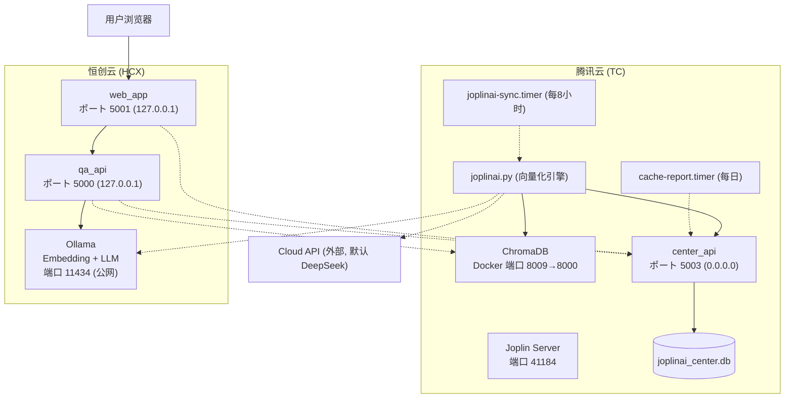
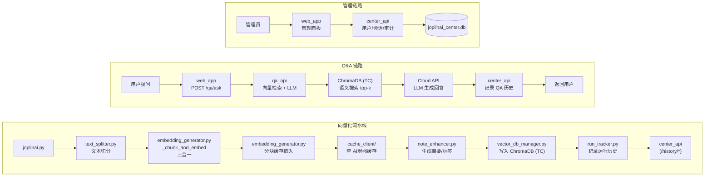
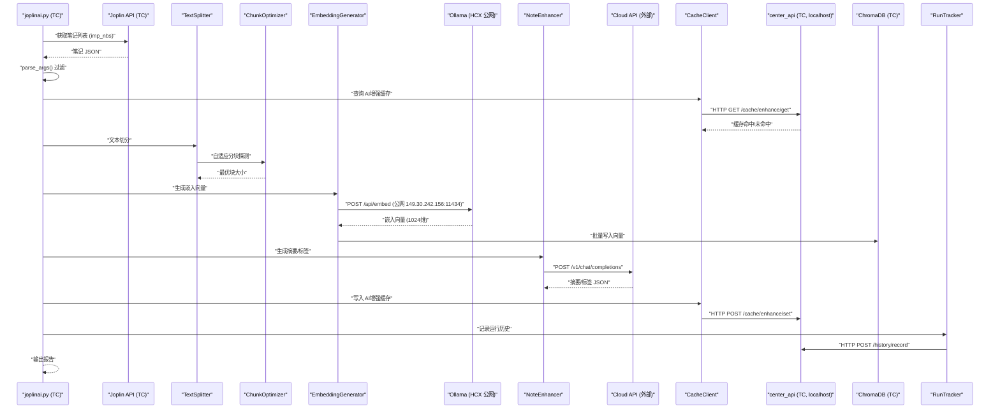
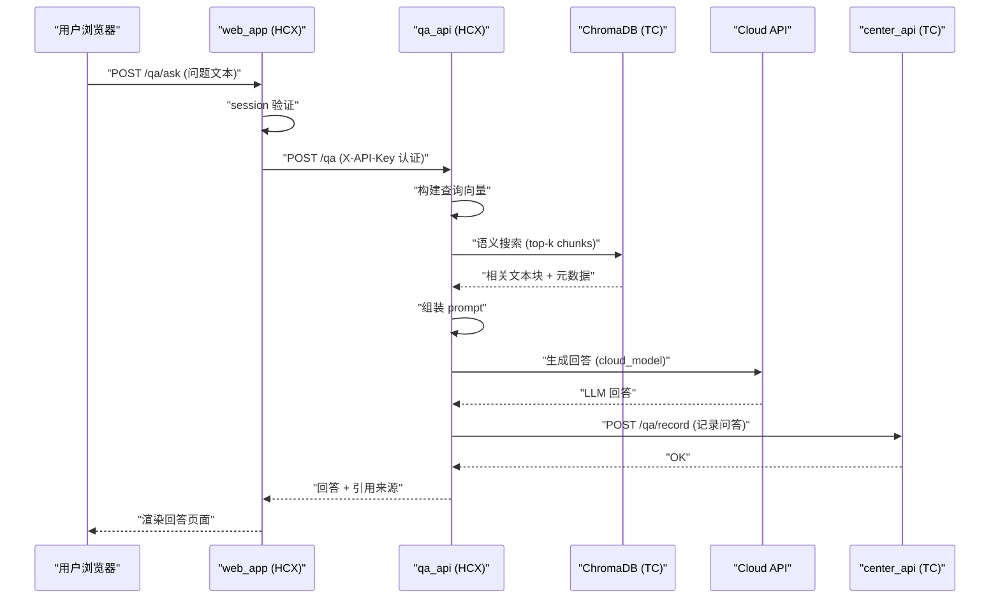
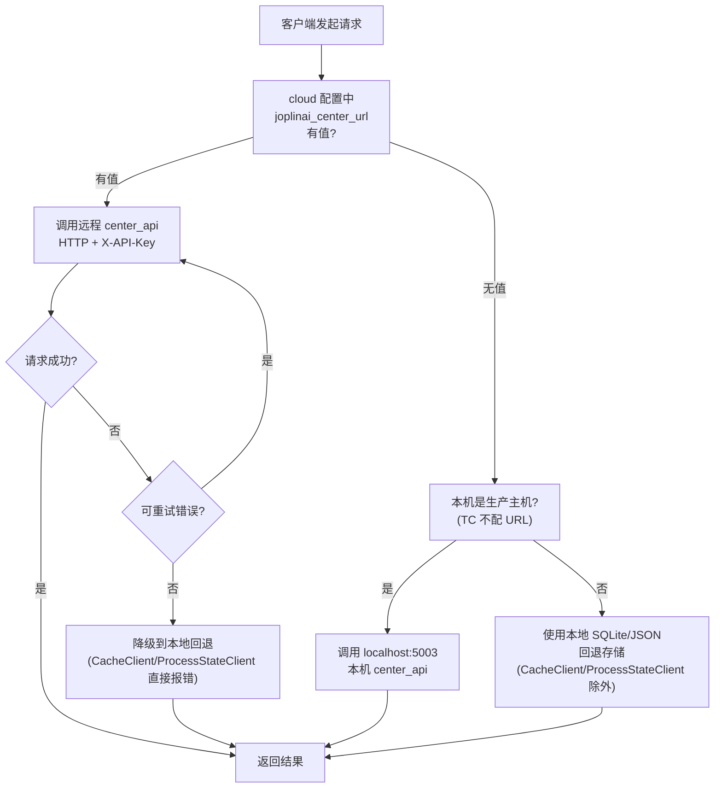
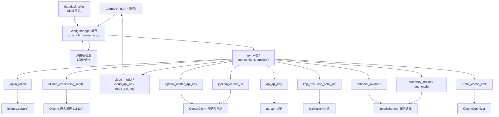
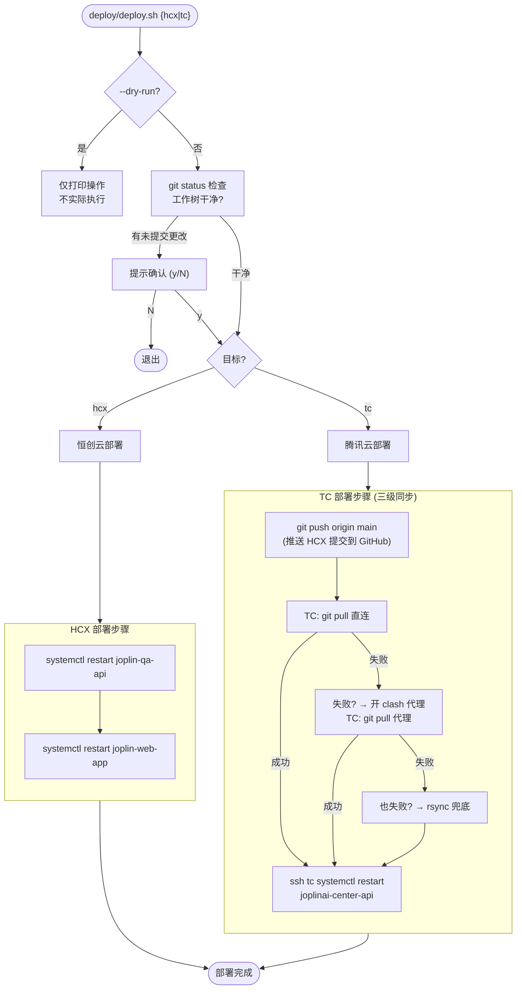
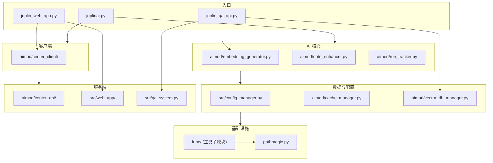

---
jupyter:
  jupytext:
    formats: ipynb,md
    split_at_heading: true
    text_representation:
      extension: .md
      format_name: markdown
      format_version: '1.3'
      jupytext_version: 1.19.1
  kernelspec:
    display_name: Python 3 (ipykernel)
    language: python
    name: python3
---

# joplinai 技术手册


面向维护人员的技术参考文档，覆盖部署拓扑、服务架构、数据流、数据库结构、配置链路与运维操作。

---


## 1. 部署拓扑




**要点：**

| 项目 | 腾讯云 (TC) | 恒创云 (HCX) |
|------|------------|-------------|
| 角色 | 数据核心 + 向量化引擎 | 推理 + 门户 |
| 运行服务 | center_api, ChromaDB, Joplin Server, joplinai.py(定时) | qa_api, web_app, Ollama |
| 对外端口 | 5003 (公网), 8009 (ChromaDB Docker) | 11434 (Ollama, TC调用) |
| 定时任务 | sync (8h), cache-report (daily) | 无 |
| 数据库 | joplinai_center.db (10表), ChromaDB向量库 | 无本地数据库 |

---


## 2. 服务架构


```mermaid
flowchart LR
    subgraph ENTRY["入口层"]
        direction TB
        A1["joplin_web_app.py<br/>joplin_web_app:app<br/>gunicorn (2 workers)"]
        A2["joplin_qa_api.py<br/>joplin_qa_api:app<br/>gunicorn (2 workers)"]
        A3["joplinai.py<br/>定时/手动 CLI (TC)"]
    end

    subgraph SRC["src/ 核心模块"]
        direction TB
        B1["web_app/ 包<br/>create_app() 工厂"]
        B2["config_manager.py"]
        B3["user_manager.py"]
        B4["queryanswer.py"]
        B5["report_writer.py"]
        B6["cli.py"]
        B7["qa_system.py"]
        B8["prompt_manager.py"]
        B9["qa_config.py"]
    end

    subgraph AIMOD["aimod/ AI 模块"]
        direction TB
        C1["center_api/ 包<br/>create_app() 工厂"]
        C2["center_client/ 包<br/>(5 个客户端)"]
        C3["embedding_generator.py"]
        C4["chunk_optimizer.py (待清理)"]
        C5["text_splitter.py"]
        C6["vector_db_manager.py"]
        C7["note_enhancer.py"]
        C8["run_tracker.py"]
        C9["cache_manager.py"]
    end

    subgraph INFRA["基础设施"]
        direction TB
        D1[("ChromaDB (TC)"]
        D2[("joplinai_center.db (TC)")]
        D3["Ollama (HCX, 公网可达)"]
        D4["Joplin Server (TC)"]
    end

    A1 --> B1
    A2 --> B4
    A3 --> C3
    A3 --> C7
    A3 --> C8

    B1 --> B2
    B1 --> B3
    B4 --> B7
    B4 --> B8
    B4 --> B9

    C2 --> C1
    C3 --> C4
    C3 --> C5
    C1 --> D2
    C6 --> D1
```

**Gunicorn 入口速查：**

| 服务 | systemd 命令 | 模式 |
|------|-------------|------|
| center_api | `"aimod.center_api:create_app()"` | app factory |
| web_app | `joplin_web_app:app` | 模块级实例 |
| qa_api | `joplin_qa_api:app` | 模块级实例 |

---


## 3. 数据流全景




**协议总览：**

| 调用方 | 被调用方 | 协议 | 认证 |
|--------|---------|------|------|
| web_app → qa_api | HCX 本地 | HTTP | X-API-Key (云端配置) |
| web_app → center_api | HCX → TC | HTTP | X-API-Key |
| qa_api → center_api | HCX → TC | HTTP | X-API-Key |
| qa_api → ChromaDB | HCX → TC | chromadb.HttpClient (HTTP, 8009) | 无 |
| qa_api → Ollama | HCX 本地 | Ollama API (11434) | 无 |
| joplinai.py → center_api | TC 本地 (127.0.0.1:5003) | HTTP | X-API-Key |
| joplinai.py → ChromaDB | TC 本地 (Docker 8009) | chromadb.HttpClient (HTTP) | 无 |
| joplinai.py → Ollama | TC → HCX (公网 149.30.242.156:11434) | Ollama API | 无 |
| joplinai.py → Cloud API | 外部 (默认 DeepSeek) | HTTPS | API Key (配置 `cloud_api_key`) |
| qa_api → Cloud API | HCX → 外部 | HTTPS | API Key (配置) |

---


## 4. 核心流程序列图


### 4a. 向量化流程



### 4b. Q&A 问答流程



### 4c. Remote-First 决策流程

> **例外**: `CacheClient` 和 `ProcessStateClient` 为纯远程模式，HTTP 失败直接报错/返回 miss，
> 不执行本地回退。其余客户端（`ProbeCacheClient`, `HistoryClient`, `UserManagerClient`）仍遵循以下流程。



---


## 5. 数据库结构


### 5a. SQLite 中心数据库

```mermaid
erDiagram
    users {
        int id PK
        text username UK
        text password_hash
        text display_name
        text role "admin/team_leader/team_member"
        text allowed_notebooks "JSON array"
        text created_at
        text updated_at
    }

    sessions {
        int id PK
        text session_id UK
        text username FK
        text created_at
        text expires_at
        text ip_address
        text user_agent
    }

    audit_log {
        int id PK
        text username
        text action
        text target
        text details "JSON"
        text timestamp
    }

    qa_history {
        int id PK
        text username FK
        text question
        text answer
        text session_id
        text metadata "JSON"
        text created_at
    }

    chat_sessions {
        int id PK
        text session_id UK
        text username FK
        text title
        text notebook_id
        text created_at
        text updated_at
    }

    enhance_cache {
        text cache_key PK "格式 {hash}_{task}_{model}"
        text content_hash
        text task
        text result
        int hit_count
        int total_hits
        text created_at
        text last_accessed
        text last_validated_at
        text validation_result
    }
    note right of enhance_cache
        查询按 content_hash+task 列匹配
        (idx_hash_task 索引)，
        不依赖 cache_key 格式。
        set() 保留 model 后缀供分析。
        每 1000 次 set 检查，超
        cache_limit(默认50000)淘汰10%。
    end note

    probe_cache {
        text text_md5 PK
        int safe_len
        text snippet
        text model_name
        int chunk_size
        text created_at
        text last_accessed
    }

    notebook_history {
        int id PK
        text notebook_id
        text notebook_title
        int note_count
        int chunk_count
        text timestamp
    }

    global_run_history {
        int id PK
        text run_id
        text started_at
        text finished_at
        text status
        text summary "JSON"
    }

    note_process_state {
        int id PK
        text note_id UK
        text notebook_id
        text content_hash
        text meta_hash "标签+笔记本标题的哈希"
        text enhance_config "summary=X|tags=Y 格式"
        text process_status
        text error_message
        int retry_count
        text last_processed
        text next_retry
    }

    users ||--o{ sessions : "username"
    users ||--o{ qa_history : "username"
    users ||--o{ chat_sessions : "username"
    users ||--o{ audit_log : "username"
```

**`note_process_state` 关键字段说明：**

| 字段 | 用途 |
|------|------|
| `content_hash` | 笔记标题+正文的哈希，内容变更时触发重新 embedding |
| `meta_hash` | 标签+笔记本标题的哈希，元数据变更时触发 metadata-only 更新 |
| `enhance_config` | 格式 `summary=X\|tags=Y`，追踪增强模型配置。模型切换（如 ollama→cloud）时自动触发重处理，无需人工干预 |
| `enhance_missing` | 增强任务是否完成。`False` 表示增强成功，`True` 下次运行自动重试 |

**`enhance_override` 笔记本级增强策略覆盖：**

云端 JSON 配置，格式 `{"笔记本标题": {"summary_model": "cloud|ollama|none", "tags_model": "cloud|ollama|none"}}`。`_resolve_enhance_config()` 运行时合并全局配置与笔记本级覆盖，未指定的笔记本沿用全局设置。适用于：某笔记本质量要求高走 cloud，某笔记本纯本地不要 API 开销等场景。

### 5b. ChromaDB 向量集合

部署于腾讯云（Docker `chromadb/chroma`，端口映射 8009→8000）。TC 通过 `127.0.0.1:8009` 本地连接，HCX 通过 `chromadb.HttpClient` 公网远程连接。

| 集合名称 | 用途 | 元数据字段 |
|---------|------|-----------|
| `joplin_{model_name}`（如 `joplin_dengcao_bge_large_zh_v1.5`） | 笔记文本块的向量索引 | `source_note_id`, `source_note_title`, `source_notebook_id`, `source_notebook_title`, `chunk_index`, `chunk_id`, `content_hash`, `meta_hash`, `note_author`, `note_type`, `tags`, `summary`, `enhanced`, `word_count`, `estimated_date` |

> **元数据增量更新**：当仅 tags/summary 变更时（content_hash 匹配，meta_hash 不同），调用 `update_chunk_metadata()` 仅更新 ChromaDB metadata，不重新生成 embeddings。

---


## 6. 配置链路




**配置优先级：** 命令行参数 > 本地 `data/joplinai.ini` > 云端 Joplin 笔记 INI > 代码硬编码默认值

---


## 7. 部署流程




**TC 同步三级策略：**

1. git pull 直连 — 先试，大多数情况能通
2. git pull + clash 代理 — 直连失败时 `proxy_on` 后重试
3. rsync — 前两步都失败才用，跳过 func/ data/ log/

**部署前检查清单：**

- [ ] 所有更改已提交
- [ ] `gunicorn` 入口正确（module:app 或 "module:create_app()"）
- [ ] HCX 本地提交已 push 到 GitHub（deploy.sh 自动执行）
- [ ] systemd service 文件已同步到 `/etc/systemd/system/`

---


## 8. 工程规范速查


### 8a. Jupytext 工作流

```
编辑 .py 源文件 → git add → git commit → pre-commit hook
                                              ├── flake8 检查
                                              └── jupytext --sync (自动生成 .ipynb)
```

| 规则 | 说明 |
|------|------|
| 源文件 | `.py` (percent 格式)，提交到 git |
| 生成文件 | `.ipynb` (自动生成，不入库，`.gitignore` 已屏蔽) |
| Cell 标记 | `# %%` 代码 cell，`# %% [markdown]` 文档 cell |
| 关键陷阱 | markdown cell 后的代码前必须有显式 `# %%`，否则代码会被注释 |
| 手动同步 | `jupytext --sync <file>.py` |
| 恢复 ipynb | `jupytext --to notebook <file>.py` |

### 8b. 代码约定

| 约定 | 适用范围 | 说明 |
|------|---------|------|
| `__all__` | 所有公有模块 | 明确导出列表 |
| `__repr__` | 5 个数据类 | CacheResult, VectorDBManager, EmbeddingGenerator, RunTracker, QASystem |
| 类型标注 | 所有公开函数 | `-> None`, `-> str`, `-> Optional[str]` 等 |
| 日志 | 所有模块 | `from aimod import get_logger; logger = get_logger(__name__)` |
| 导入 | 全项目 | 统一包前缀 `src.` / `aimod.` / `func.` |
| pathmagic | 任意入口 | `with pathmagic.Context():` 包裹项目导入 |


### 8c. 代码质量命令

```bash
# Lint
flake8 . --max-line-length=100 --ignore=E402,W503,E203,E501 --exclude=func/

# 测试
python -m pytest tests/ -v --tb=short

# Pre-commit (手动触发)
pre-commit run --all-files
```

---

## 9. 维护操作速查

### 9a. 服务管理

```bash
# === 恒创云 (HCX) ===
sudo systemctl status joplin-qa-api       # 查看 QA API 状态
sudo systemctl status joplin-web-app      # 查看 Web 门户状态
sudo systemctl restart joplin-qa-api      # 重启 QA API
sudo systemctl restart joplin-web-app     # 重启 Web 门户
sudo journalctl -u joplin-qa-api -f       # QA API 实时日志
sudo journalctl -u joplin-web-app -f      # Web 门户实时日志

# === 腾讯云 (TC) ===
ssh tc "sudo systemctl status joplinai-center-api"
ssh tc "sudo systemctl restart --no-block joplinai-center-api"
ssh tc "sudo journalctl -u joplinai-center-api -f"

# ChromaDB (TC)
ssh tc "docker ps | grep chroma"
ssh tc "docker restart chroma-server"

# 定时器
ssh tc "sudo systemctl status joplinai-sync.timer"
ssh tc "sudo systemctl status joplinai-cache-report.timer"
```

### 9b. 健康检查

```bash
# center_api
curl http://127.0.0.1:5003/health          # 本地
curl http://122.51.102.233:5003/health     # 外部 (TC 公网)

# qa_api
curl -H "X-API-Key: <key>" http://127.0.0.1:5000/health

# web_app
curl -I http://127.0.0.1:5001/             # 应返回 302 → /login

# ChromaDB (TC, Docker 端口映射 8009→8000)
ssh tc "curl -s http://127.0.0.1:8009/api/v1/heartbeat"
```

### 9c. 日志文件

| 服务 | 访问日志 | 错误日志 |
|------|---------|---------|
| center_api | `/var/log/joplin-qa/cache_access.log` | `/var/log/joplin-qa/cache_error.log` |
| qa_api | `/var/log/joplin-qa/qa_access.log` | `/var/log/joplin-qa/qa_error.log` |
| web_app | `/var/log/joplin-qa/web_access.log` | `/var/log/joplin-qa/web_error.log` |

### 9d. 常见排查路径

| 症状 | 检查步骤 |
|------|---------|
| Web 页面 502/500 | `journalctl -u joplin-web-app -f` → 检查 gunicorn error log |
| Q&A 返回空 | 检查 TC ChromaDB 是否运行(Docker 8009) → 检查 ChromaDB 是否有数据 → 检查 HCX Ollama(11434) |
| center_api 无响应 | `ssh tc` → `systemctl status joplinai-center-api` → 检查数据库 |
| 定时同步失败 | `ssh tc` → `journalctl -u joplinai-sync.service` → 检查 Joplin API 连通性 |
| 配置不生效 | 检查云端 Joplin 笔记 INI → 等 5 分钟热更新或重启服务 |
| jupytext 代码被注释 | 检查 markdown cell 后是否有显式 `# %%` → `jupytext --sync` 修复 |

### 9e. 手动操作

```bash
# 手动触发向量同步
ssh tc "sudo systemctl start joplinai-sync.service"

# 手动生成缓存报告
ssh tc "sudo systemctl start joplinai-cache-report.service"

# 手动执行报告 (HCX)
cd /data/codebase/joplinai && python src/report_writer.py --type all --output joplin

# 重新同步 ipynb
jupytext --sync path/to/file.py

# rsync 到 TC (跳过 func/ data/ log/)
cd /data/codebase/joplinai && rsync -avz --delete \
  --exclude="func/" --exclude=".git/" --exclude="__pycache__/" \
  --exclude="*.pyc" --exclude="data/" --exclude="log/" \
  --exclude="*.ipynb" --exclude="node_modules/" \
  /data/codebase/joplinai/ tc:/home/baiyefeng/work/joplinai/
```

---

## 10. 文件清单

### 10a. 入口文件

| 文件 | 用途 | 部署位置 |
|------|------|---------|
| `joplin_web_app.py` | Web 门户入口 | HCX |
| `joplin_qa_api.py` | Q&A API 入口 | HCX |
| `joplinai.py` | 向量化 CLI | TC (定时 + 手动) |
| `aimod/center_api/__init__.py` | 数据中心入口 (app factory) | TC |
| `src/report_writer.py` | 报告生成 CLI | HCX (手动) |
| `src/cli.py` | 共享 CLI 参数解析 | HCX (被 joplinai.py 调用) |

### 10b. 关键模块依赖方向



**依赖原则：** 上层依赖下层，同层可互调，禁止下层反向依赖上层。`func/` 为最底层，不依赖项目任何模块。

---

## 附录 A：Mermaid 渲染兼容性说明

本手册中所有 mermaid 图的节点标签均使用双引号包裹（`["标签"]`），避免 Joplin 客户端因特殊字符（`/`、`:`、`-`、`(`、`)`）渲染失败。如在其他渲染器中打开，去掉双引号即可获得更简洁的显示效果。

---

> 最后更新：2026-05-18 | joplinai main 分支
